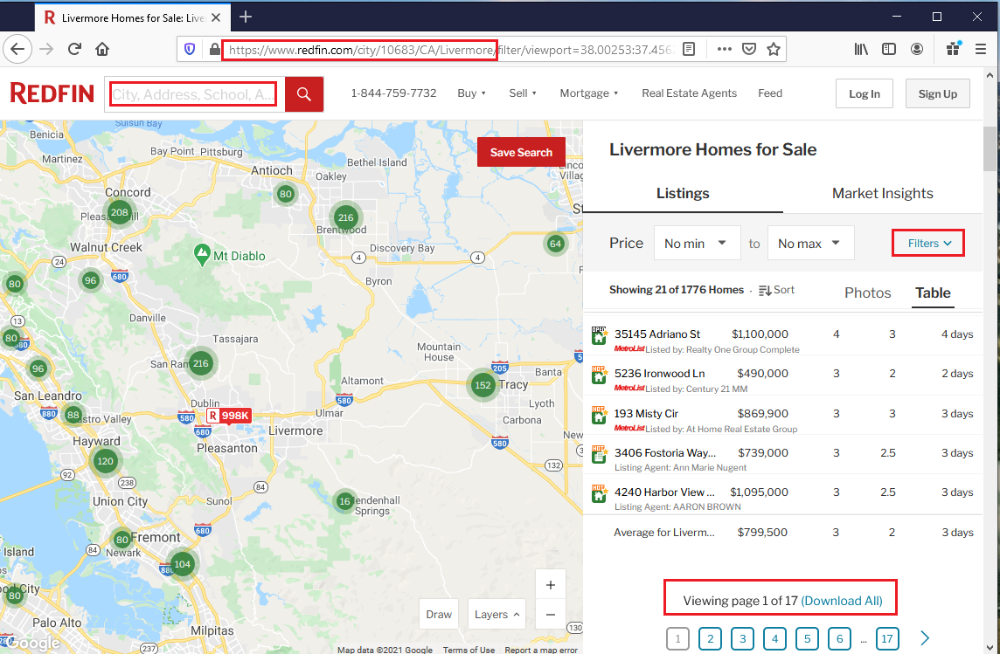

# Data Sources and Data Description

## Contents
1. [Data Sources](#data-sources)
2. [Data Description](#data-description)
3. [Data Acquisition Challenges](#data-acq-challenges)

### Data Sources

The problem we are trying to solve involves data gathering from a variety of sources. The main challenge and handicap of all of the current websites is that not all the information is present in one dashboard or platform for the family head of our fictitious family to filter and narrow his search. We will primarily use two main sources of data and mention a third one (which is not being used in this project, but was analyzed and the analysis would be presented in the final presentation). The main sources of data we would be using in this project includes:

  * Home prices (of "current" listings) from [Redfin](https://www.redfin.com/)
  * Venue data from [Foursquare API](https://developer.foursquare.com/docs/api-reference/venues/categories/)
  * California School data from [CA School Dashboard](https://www.cde.ca.gov/ta/ac/cm/#)
  
#### Why Redfin over others?

The main reason for choosing Redfin although there are various other similar websites is the ease of data collection. Websites like Craigslist are difficult to gather data from (even while using python scrapping libraries like BeautifulSoup). Further Craigslist is not as well trusted for expensive purchases. Websites like Zillow and MLS Listings, though very popular and trusted require us to scrap the webpage in order to collect and refine the data. On the other hand, Redfin allows you to search the data and download the data as a .csv file right away from the search page. I did not know about this feature until I started working on this project and it is very useful for anyone looking at such data (and until the feature exists). I am pointing to the feature in the screen-capture below:

### Data Description

### Data Acquisition Challenges

### Situational Challenges

