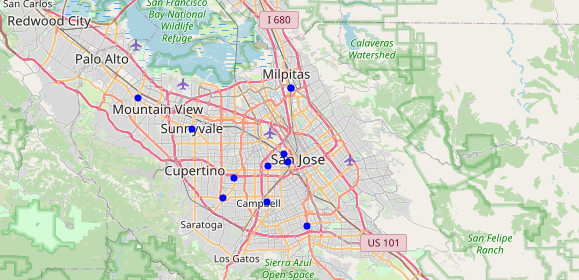

# Data Sources and Data Description

## Contents
1. [Data Sources](#data-sources) 
    1.1. [Why Redfin over Others?](#why-redfin) 
    1.2. [Why Foursquare API?](#why-foursquare) 
    2.3. [Why CA School Dashboard?](#why-ca-school-dashboard) 
2. [Data Description](#data-description)
3. [Data Acquisition Challenges](#data-acq-challenges)

### Data Sources

The problem we are trying to solve involves data gathering from a variety of sources. The main challenge and handicap of all of the current websites is that not all the information is present in one dashboard or platform for the family head of our fictitious family to filter and narrow his search. We will primarily use two main sources of data and mention a third one (which is not being used in this project, but was analyzed and the analysis would be presented in the final presentation). The main sources of data we would be using in this project includes:

  * Home prices (of "current" listings) from [Redfin](https://www.redfin.com/)
  * Venue data from [Foursquare API](https://developer.foursquare.com/docs/api-reference/venues/categories/)
  * California School data from [CA School Dashboard](https://www.cde.ca.gov/ta/ac/cm/#)
  
#### Why Redfin over Others?

The main reason for choosing Redfin although there are various other similar websites is the ease of data collection. Websites like Craigslist are difficult to gather data from (even while using python scrapping libraries like BeautifulSoup). Further Craigslist is not as well trusted for expensive purchases. Websites like Zillow and MLS Listings, though very popular and trusted require us to scrap the webpage in order to collect and refine the data. On the other hand, Redfin allows you to search the data and download the data as a .csv file right away from the search page. I did not know about this feature until I started working on this project and it is very useful for anyone looking at such data (and until the feature exists). I am pointing to the feature in the screen-capture below:

#### Why Foursquare API?

Although I knew about Foursquare and the quality of their data, I had never used their API until the last few weeks when the course introduced us to using Foursquare API. The quality of the data is much more reliable (the location data, rather than reviews) and it is provided in a structure that is very ameanable to parse automatically. The [venue categories](https://developer.foursquare.com/docs/build-with-foursquare/categories/) provided by the API is very comprehensive (although there were certain categories that I could not find or did not have enough entries around my own locality) and it provides all the necessary ingredients for the solution to the problem we are trying to solve. We can also iterate over nearby locations (given an anchor location) which is very handy when you want to find all the restaurants (target venues) near to a given restaurant (anchor venue). I have used this extensively in the project.

#### Why CA School Dashboard?

CA provides a school dashboard that has a lot of information that could be used to infer demography, quality of schools, qualities in specific subjects (like Math), etc. Further this system apparently put in places recently to replace an archaic system of test scores. I am not sure which system was better, but I used the latest available data. Although the data-set was analyzed I did not want to include the inference in the project as it was a very difficult year to make sense of school data. 

### Data Description

The housing data provided by RedFin is a csv file that has the following features:
* property_type
* zipcode
* city
* number of bedrooms
* number of bathrooms
* square foot area of the property
* year the property was built
* lot size of the property
* latitude and longitude
* current price at which the property is listed for sale

There are other fields like MLS listing number and URL that are not relevant for our analysis and hence were ignored as a part of the data pre-processing phase.

The Foursquare API data is not a ready-made data, rather some functions written in Python along with some data processing in order to get the list of venues that pertain to a specific category and a specific anchor location. The anchor location could be my location (or the location of my potential future new house) and target locations are all the interesting venues that are around the anchor location. For example, one could list out the list of grocery stores or vegan restaurants around an anchor location to check if it would be a preferred location to live. The result could be something like the following, a list of Supermarkets (Venue, Venue Category) around an anchor location:

 
The results could very well be presented in a map, thanks to the introduction of [Folium library](https://python-visualization.github.io/folium/) as part of the course. The map below, for example, shows the grocery stores in a particular region: 

 
The CA school dashboard provides a wealth of information that could be analyzed to make several inferences. Besides the quality of schools, one could also infer the poverty in several districts and the demographic diversity in several districts, providing valuable information to policy makers in order to decide and fast track their investment in those districts. For example, from the migrant data (which is a part of the data provided - ethnicity, race, migrants, etc.), one could see the regions with most migrants:
 

 

### Data Acquisition Challenges

The main challenge was to look for disparate sources of information and combine them using a reliable common index that is a part of each of the data sources. I decided this common index to be the geographic coordinates (latitude and longitude) as they are more reliable and their reliability can be checked by marking them on a map. Now, given that geographic coordinates is the one that would tie the housing, venues and school data together, one has to find reliable sources of information for each of these subjects. 

The housing data was the most challenging one as there was no single website that allowed to download the data in a ready-made consumable format. While Craigslist, Zillow webpages could be scrapped using BeautifulSoup library, it was very cumbersome as some of the listings were mis-aligned and this eventually leads to more data preprocessing effort. I happened to learn that Redfin provided a consumable format (and that too, in the form of a .csv file) and Redfin being a well-reputed real estate company, I decided on using it as my data source for home proces.

In order to search for interesting venues, I decided to use Foursquare API. However, there are limits (to the number of venues/categories) that one could query using a free account. I ended up writing a Python function to query interesting venues and then more venues around the venue found and populate a dataframe. I still had to do this over multiple days as I ran out of the number of free requests allowed. One could write the results to a .csv file from the dataframe and readily load it for analysis the next time.

CA school data was straight-forward and it also provides a wealth of information. 

### Situational Challenges

The pandemic caused lots of schools to go virtual and being a passionate teacher myself, I can attest that the quality of virtual education may or may not fit the needs of all of the students and hence any reports on students that come out in 2020 might not propertly reflect the actual capabilties of the students. Further due to the movement of population from expensive neighborhoods like San Francisco (city) to the suburbs and from Silicon Valley to other states (due to remote-work becoming the norm in many tech workplaces), there is a huge demographic shift in schools (one of the goals of analyzing school data was also to infer the demography in the region). This is one of the primary reasons I did not go ahead with using the results from the inferences made from school data in my project.

Similarly, using historical real estate prices from California is going to lead to inaccuracies (huge inaccuracies) due to the shift caused by the pandemic. A more reliable and current indicator would be the current prices at which real-estate prices are listed. And one could always go to Redfin webpage and download the current listings (and in a .csv format). In a year from now, when prices might change and will be very different from what they are at present, one could always use the Redfin webpage to download the current prices and still use the application I develop.

Again, with Foursquare API, some of the venues, especially small businesses, might have shut down due to the ill effects of the pandemic. But it is more likely that some of those would reopen and due to the large dataset that also includes supermarket chains as well as mom and pop stores, it would have a smaller discrepancy on the analysis.

