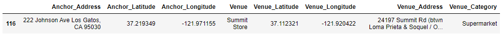

## Contents
1. [Background and Motivation](#motivation)
2. [Objectives and Key Results](#okr)<br>
  2.1. [Audience](#audience)<br>
3. [Drawbacks of Current Applications](#curr-drawbacks)<br>
  3.1. [What is available now?](#available)<br>
  3.2. [What is not available now?](#not-available)<br>
  3.3. [How to fill the gaps?](#fill-the-gap)<br>
4. [This work](#this-work)<br>
  4.1. [Data Sources](#data-sources)<br>
  4.2. [Part-1 Using Foursquare API to identify interesting locations based on custom criteria](#4sq-api)<br>
      4.2.a. [Technical Details](#part1-tech)<br>
  4.3. [Part-2 Using Machine Learning Techniques to estimate house prices in interesting locations](#house-pr-estimation)<br>
      4.3.a. [Technical Details](#part2-tech)<br>
  4.4. [Learnings](#learnings)<br>
5. [Conclusions and Possible Extensions](#conclusions)

### 1. Background and Motivation<a name="motivation"></a>

This is about a fictitious family of eight - a husband and wife, their three children, the man's parents and his sister. They sold their belongings in their current hometown - a small beautiful village rich in culture and heritage, and moving to California in search of a better life for themselves and their children. A "large" family by California standards and with limited amount of money in hand, he has to find a house large enough to house all of his family and one that also fits his budget. So, here are some of his informal requirements:
  * His mother has issues with her knee and is old. She can't walk up stairs often and hence he prefers to find a house that has enough room at the lower level.
  * His mother is a wonderful cook and in their village was cooking delicacies for families for little money that also went to support the family. 
  * His father was a car mechanic and would like to continue that work part of the week, in order to earn some income. He is old and not advised to drive by himself. They would like to have some car garages close to home so that he could find some part-time work.
  * His wife had worked in two small grocery stores in their village and would like to find a similar job in California. She does not drive. They would like to live in a place close to some grocery stores so that she could find work and could walk or bike to them. 
  * He worked as a primary school teacher during the day, cooked in restaurants during the evenings, waited in bars for part of the night, and was also involved in theatre during the weekends - all to support his awesome family. Since commute time is a lot in California, they would like to live in a neighbourhood that has some of these possibilities if not all, so that he could make enough time for his family while spending enough time to make ends meet.
  * Their youngest son is autistic and needs special care. His eldest daughter is a track and field athlete and has won several awards. They would like to encourage her and believe she has the potential to become an Olympian in future, if property nurtured. They would like to live close to some track stadium so that she could practice and get the necessary coaching.

Although he is moving to the epicentre of technology innovation, he is surprised that there is no website where he could look to purchase a property given the several requirements he has. 

### 2. Objectives and Key Results<a name="okr"></a>

An application to decide where to move your family and live based not only on the cost of housing, but also on
* opportunities for yourself
* opportunities for your immediate family (spouse, parents)
* fueling your childrens' ambitions and creating opportunities for them

#### 2.1. Audience<a name="audience"></a>

This would be an application that could be used by anyone who would like a more generic application that lets them analyze for more kinds of categories rather than just real estate price or touristic importance. It could be a people moving to a new place for work, for starting a new life, with specific interests and needs.

### 3. Drawbacks of Current Applications<a name="curr-drawbacks"></a>

Of course, there are many applications that provide housing prices (Redfin, Zillow, etc.) as well as several applications (Google Maps, Foursquare, Yelp, etc.) that provide information on interesting places around any city or location. But there is more to it than just restaurants, bars, pubs and housing prices. There are many other restrictions that one might need to take into account.

#### 3.1. What is available now?<a name="available"></a>

At the moment, when you want to move your family, say to a particular city or county in the Bay area, cost of living immediately comes to mind. One goes through websites like [Craigslist](https://sfbay.craigslist.org/d/apartments-housing-for-rent/search/apa) to find houses that fit their requirements (size) and budget (rent) or when one wants to permanently relocate to an area one would look at websites like [Redfin](https://www.redfin.com/) or [Zillow](https://www.zillow.com/) to find houses that fit their requirements (size, school district, etc.) and budget (home prices). Besides ratings of different schools in the area, they also provide detailed history of the property itself, detailing when it was built, renovated, what kind of heating it has, an estimate of monthly mortgage payments, etc. Further, one could filter the houses based on several of these parameters to narrow down one's search.

#### 3.2. What is not available now?<a name="not-available"></a>

But all of these websites, though they are geared towards catering to the needs of customers main interests (school quality for their kids, price, etc.) they hardly cater to the needs of the individuals. Of course, they might advertise the house being closer to "Silicon Valley tech companies" or "Apple's Spaceship" or walkable from "Marina Green", but if you are a family trying to work several jobs to make ends meet, it doesn't provide you how many restaurants or grocery stores are nearby where family members could work part-time during the evenings to provide for one's family. Neither does it provide information on the kinds of activities (like a swim school producing Olympians, etc.) that one would want in order to nurture their potential. This leads to the families trying to gather this information through word-of-mouth or by trying to assemble information gathered from several disparate sources of information which is both time-consuming and error prone.

#### 3.3. How to fill the gaps?<a name="fill-the-gap"></a>

There are disparate sources of information available through various websites. In order to stitch these together, I will use the knowledge learnt during the past few weeks and come up with an application that, even if not perfect, would cover much of the ground and would serve as a platform to build more things on. 

### 4. This Work<a name="this-work"></a>

In this work, we try to bridge some of the gaps mentioned above. We use two main sources of data which provide disparate pieces of information and use the data science skills acquired during the course to stitch the pieces into a single useful application. There are two main parts to this exercise:

1. Part-1: In this effort, we use Foursquare API to identify interesting locations around a given set of possible addresses. As mentioned above looking for interesting locations may mean different things to different people. While the currently available applications cater to the mostly widely sought after interests like restaurants and night life, it doesn't cater to the more important needs of finding a second part-time job in a grocery store or mexican restaurant or a special needs school or a swimming pool to train for Olympics, which may all be important for someone making a move to a new city.

2. Part-2: Having identified interesting locations from Part-1 above, one would want to estimate the housing prices in the different interesting locations. The COVID pandemic has caused a huge migration of people from cities to suburbs and less expensive cities causing a major shift in real estate prices. So, learning from historic prices is going to give us a wrong estimate. However, Redfin allows us to download current listings (houses listed for sale) as a csv file. This would provide the most recent prices and could be used to estimate the current amount one would have to spend.

#### 4.1. Data Sources<a name="data-sources"></a>

The problem we are trying to solve involves data gathering from a variety of sources. The main challenge and handicap of all of the current websites is that not all the information is present in one dashboard or platform for the family head of our fictitious family to filter and narrow his search. We will primarily use two main sources of data and mention a third one (which is not being used in this project, but was analyzed and the analysis would be presented in the final presentation). The main sources of data we would be using in this project includes:

  * Home prices (of "current" listings) from [Redfin](https://www.redfin.com/)
  * Venue data from [Foursquare API](https://developer.foursquare.com/docs/api-reference/venues/categories/)
  * California School data from [CA School Dashboard](https://www.cde.ca.gov/ta/ac/cm/#)
  
##### Why Redfin over Others?<a name="why-redfin"></a>

The main reason for choosing Redfin although there are various other similar websites is the ease of data collection. Websites like Craigslist are difficult to gather data from (even while using python scrapping libraries like BeautifulSoup). Further Craigslist is not as well trusted for expensive purchases. Websites like Zillow and MLS Listings, though very popular and trusted require us to scrap the webpage in order to collect and refine the data. On the other hand, Redfin allows you to search the data and download the data as a .csv file right away from the search page. I did not know about this feature until I started working on this project and it is very useful for anyone looking at such data (and until the feature exists). I am pointing to the feature in the screen-capture below: <br>


<br>

##### Why Foursquare API?<a name="why-foursquare"></a>

Although I knew about Foursquare and the quality of their data, I had never used their API until the last few weeks when the course introduced us to using Foursquare API. The quality of the data is much more reliable (the location data, rather than reviews) and it is provided in a structure that is very ameanable to parse automatically. The [venue categories](https://developer.foursquare.com/docs/build-with-foursquare/categories/) provided by the API is very comprehensive (although there were certain categories that I could not find or did not have enough entries around my own locality) and it provides all the necessary ingredients for the solution to the problem we are trying to solve. We can also iterate over nearby locations (given an anchor location) which is very handy when you want to find all the restaurants (target venues) near to a given restaurant (anchor venue). I have used this extensively in the project.

#### 4.2. Part-1 Using Foursquare API to identify interesting locations based on custom criteria<a name="4sq-api"></a>

The Foursquare API data is not a ready-made data, rather some functions written in Python along with some data processing in order to get the list of venues that pertain to a specific category and a specific anchor location. The anchor location could be my location (or the location of my potential future new house) and target locations are all the interesting venues that are around the anchor location. For example, one could list out the list of grocery stores or vegan restaurants around an anchor location to check if it would be a preferred location to live. The result could be something like the following, a list of Supermarkets (Venue, Venue Category) around an anchor location: <br>


<br>

The results could very well be presented in a map, thanks to the introduction of [Folium library](https://python-visualization.github.io/folium/) as part of the course. The map below, for example, shows the grocery stores in a particular region:<br>


<br>

##### 4.2.a. Technical Details<a name="part1-tech"></a>

In order to achieve collecting interesting locations from Foursquare API, we follow the usual process of forming a request url using our Foursquare account credentials, search criteria, etc. We can then parse the response from Foursquare and extract the different components. However we would like to automate this process and collect as many interesting locations as possible around a given anchor location progressively. We capture this in the form of a python function. We might have a list of anchor addresses/locations and we have to find the geographical coordinates of the anchor addresses as well in order to use Foursquare API to extract the interesting target locations around these anchor geographical coordinates. 

We first write a simple function `get_addr_df()` to get the geographical coordinates of anchor locations, given a string list of anchor locations as input. We also format the output in the form of a Pandas dataframe.

```python
def get_addr_df(addr_lst):
    lst = []
    geolocator = Nominatim(user_agent='my_explorer')
    for i in addr_lst:
        location = geolocator.geocode(i)
        lst.append((i, location.latitude, location.longitude))
    df = pd.DataFrame(data=lst, columns=['Address', 'Latitude', 'Longitude'])
    return df
```

We then use the Foursquare API in order to find the intersting locations around each of the geographical coordinates obtained as output from the function above. We shall call this function `get_cool_places()` which takes as inputs:
* a set of neighbourhoods
* geographical coordinates
* radius around which to search
* number of venues

Again, we will return a Pandas dataframe that not only contains the details of interesting venues, it also contains the anchor location details around which interseting venues are located.

```python
def get_cool_places(neighborhoods, 
                    latitudes, longitudes,
                    radius=200, venue_num=300):
    # placeholder for collecting interesting venues
    venues_list=[]
    
    # loop around the anchored locations (neighbourhood, lat, lng)
    for name, lat, lng in zip(neighborhoods, latitudes, longitudes):
        # count venue_id from 0 .. venue_num
        # 50 at a time
        venue_id = 0
        while (venue_id < venue_num + 50):
            # construct request url
            request_url = 'https://api.foursquare.com/v2/venues/explore?&client_id={}&client_secret={}&v={}&ll={},{}&radius={}&offset={}&limit={}'.format(
            CLIENT_ID, 
            CLIENT_SECRET, 
            VERSION, 
            lat, 
            lng, 
            radius,
            venue_id,
            LIMIT)
        # send the request
            results = requests.get(request_url).json()['response']['groups'][0]['items']
        # filter the results to capture fields of interest
            for v in results:
                venues_list.append([(
                        name, 
                        lat, 
                        lng, 
                        v['venue']['name'], 
                        v['venue']['location']['lat'], 
                        v['venue']['location']['lng'],
                        v['venue']['location']['formattedAddress'][0],
                        v['venue']['categories'][0]['name'])])
            venue_id = venue_id + 50
    venues_list = list(venues_list)
    interesting_venues = pd.DataFrame([item for venue_list in venues_list for item in venue_list])
    interesting_venues.columns = ['Anchor_Address', 
                      'Anchor_Latitude', 
                      'Anchor_Longitude', 
                      'Venue', 
                      'Venue_Latitude', 
                      'Venue_Longitude',
                      'Venue_Address',
                      'Venue_Category']
    print('Finished collecting all cool places. Check out the dataframe')
    return(interesting_venues)
  ```
We can call the above function as:
```python
cool_places = get_cool_places(my_addr_df['Address'], 
                              my_addr_df['Latitude'], 
                              my_addr_df['Longitude'], 
                              radius=60000, 
                              venue_num=300)
```
where `my_addr_df` is the output of our geographical data identifying function `get_addr_df()` defined previously.

Now comes the interesting part: we can define our own set of categories of interest, as a python list of strings and filter the large set of venues output by the above function. For example, one family member might look for grocery store to find part-time job, another might look for a swimming pool or a park, another would look for some other recreation, etc.

We again write a simple function `get_interesting_places()` that accepts a dataframe and a list of categories and returns a dataframe containing details of venues that fall in the list of categories provided.

```python
def get_interesting_places(places_df, my_categories):
    pat = ''
    n = len(my_categories)
    for i in range(n-1):
        pat = pat + my_categories[i] + '|'
    pat = pat + my_categories[n-1]
    return places_df[places_df['Venue_Category'].str.contains(pat, case=False, regex=True)]
```

For example, I might be looking for work in some market or a restaurant, and so define my categories as:
```python
my_work_categories = ['Restaurant', 'market']
```

We can call our function as follows:

```python
my_work_places = get_interesting_places(cool_places, my_work_categories)
```

where `cool_places` is the dataframe returned by the function `get_cool_places()` defined previously.

Another member of a family might have a different set of interests:

```python
my_leisure_categories = ['gym', 'pool', 'trail']
my_leisure_places = get_interesting_places(cool_places, my_leisure_categories)
```

Suppose I have short-listed an address to live in but I forgot to check if there are Vegan restaurants around, as I am a new Vegan (new year resolution, you see). We can write a small generic function to accomplish this:

```python
def get_interesting_places_around_addr(addr, places_df, my_categories):
    pat = ''
    n = len(my_categories)
    for i in range(n-1):
        pat = pat + my_categories[i] + '|'
    pat = pat + my_categories[n-1]
    return places_df[(places_df['Anchor_Address']==addr) & places_df['Venue_Category'].str.contains(pat, case=False, regex=True)]
```

and use it in the following manner:

```python
my_new_addr = '3159 Kenland Dr, San Jose, CA 95111'
my_restrictions = ['Vegan', 'Vegetarian']
my_food_places = get_interesting_places_around_addr(my_new_addr, cool_places, my_restrictions)
```

Finally, to make it visually appealing we can display it on a map. We can use the awesome Folium library in order to achieve this. As always, this can be wrapped inside a small and simple python function:

```python
def show_places_on_map(addr, df):
    geolocator = Nominatim(user_agent='map_explorer')
    location = geolocator.geocode(addr)
    addr_lat = location.latitude
    addr_lng = location.longitude
    smap = folium.Map(location=[addr_lat, addr_lng], zoom_start=10)
    
    folium.CircleMarker(
    [addr_lat, addr_lng],
    radius=3,
    color='red',
    popup='My Home',
    fill = True,
    fill_color = 'red',
    fill_opacity = 0.6
    ).add_to(smap)
    for lat, lng, v, label in zip(df.Venue_Latitude, 
                           df.Venue_Longitude,
                           df.Venue,
                           df.Venue_Category):
        folium.CircleMarker(
                    [lat, lng],
                    radius=5,
                    color='yellow',
                    popup=v,
                    fill = True,
                    fill_color='blue',
                    fill_opacity=0.6
                ).add_to(smap)
    return smap
```

which can be called as follows:

```python
map = show_places_on_map(my_new_addr, my_work_places)
map
```

The result might look something like this:


<br>

#### 4.3. Part-2 Using Machine Learning Techniques to estimate house prices in interesting locations<a name="house-pr-estimation"></a>

In this exercise, we would use Redfin dataset to estimate current house prices around interesting locations. Redfin website allows one to download the current listings as a csv file ('fin_df.csv'). The data for this exercise was downloaded in that manner. Let us start by importing all the necessary modules.

The Redfin data set was downloaded as a csv file, in fact as several csv files (one per region of search in Redfin webpage), merged into a single dataframe, cleaned and saved as one monolithic csv file ready for analysis. The cleaning involved removing entries that are NaN, removing listings that had '0.0' for number of bedrooms, stripping hyphenated zipcodes, etc. There was more processing done in order to do linear regression on the dataset. These were achieved using the scikit-learn library as detailed in the next section.

##### 4.3.a. Technical Details<a name="part2-tech"></a>

We read the saved data into a data-frame and capture only interesting features (in particular we leave out the house listing number, city, URL for the listing, etc.). We also keep only columns of interst (remove irrelevant columns like listing number, etc.):
```python
df = pd.read_csv('fin_df.csv')
columns = ['property_type', 'zipcode', 'beds', 'baths',
          'sq_ft', 'year_built', 'lot_size','latitude', 'longitude', 'price']
housing = df[columns]
```

Since we have missing values, we use scikit-learn's SimpleImputer to impute the missing values. We chose the "most_frequent" strategy, rather than 'mean'. We shall use scikit-learn's `SimpleImputer` for this purpose:

```python
imp = SimpleImputer(missing_values=np.nan, strategy='most_frequent')
imp = imp.fit(housing.iloc[:,1:7])
housing.iloc[:,1:7] = imp.transform(housing.iloc[:, 1:7])
```
We also write a couple of utility functions to split our dataset into training and test sets:

```python
# use the id value, hash it and use this for splitting
# the dataset into training and test sets, so that the 
# results are reproducible
def test_set_check(identifier, test_ratio, hash):
    return hash(np.int64(identifier)).digest()[-1] < 256 * test_ratio

# utility function to split the dataset by id
def split_train_test_by_id(data, test_ratio, id_column, hash=hashlib.md5):
    ids = data[id_column]
    in_test_set = ids.apply(lambda id_: test_set_check(id_, test_ratio, hash))
    return data.loc[~in_test_set], data.loc[in_test_set]
```

We can how split the dataset into training and test sets as follows:

```python
train_set, test_set = split_train_test_by_id(housing, 0.2, 'index')
```
We split the numerical and categorical data. We do this inorder to encode the categorical data to make it amenable for our linear regression purposes.

```python
# numerical data
train_num = train_set.drop(['property_type'], axis=1)
test_num = test_set.drop(['property_type'], axis=1)

# categorical data
train_cat_1 = train_set['property_type']
train_cat1_enc, train_cat1 = train_cat_1.factorize()

test_cat_1 = test_set['property_type']
test_cat1_enc, test_cat1 = test_cat_1.factorize()
```

We then encode the categorical variables using scikit-learn's `Onehot encoding`

```python
enc = OneHotEncoder()
train_cat1_1hot = enc.fit_transform(train_cat1_enc.reshape(-1, 1))
test_cat1_1hot = enc.fit_transform(test_cat1_enc.reshape(-1, 1))
```

We build a pipeline to do the above in a sequence. In order to achieve that we also define utility methods to select categorical and numerical data

```python
# utility class/methods to select numerical and categorical
# data (by passing numerical and categorical columns as attributes)
class DataFrameSelector(BaseEstimator, TransformerMixin):
    def __init__(self, attribute_names):
        self.attribute_names = attribute_names
    def fit(self, X, y=None):
        return self
    def transform(self, X):
        return X[self.attribute_names].values
```

```python
# pipeline for numerical data
num_pipeline = Pipeline([
    ('selector', DataFrameSelector(num_attribs)),
    ('std_scaler', StandardScaler()),
])

# pipeline for categorical data
cat_pipeline = Pipeline([
    ('selector', DataFrameSelector(cat_attribs)),
    ('cat_encoder', OneHotEncoder(sparse=False)),
])

# merged pipeline
full_pipeline = FeatureUnion(transformer_list=[
    ('num_pipeline', num_pipeline),
    ('cat_pipeline', cat_pipeline),
])
```
We then prepare the training and test data, passing it through the pipeline:

```python
training_prepared = full_pipeline.fit_transform(train_set)
test_prepared = full_pipeline.fit_transform(test_set)

training_labels = train_set['price'].copy()
test_labels = test_set['price'].copy()
```

We then fit a Linear Regression model to this dataset (specifically training data):

```python
lr = LinearRegression()
lr.fit(training_prepared, training_labels)
```

We can see what this model `lr` predicts on a subset of our (test) dataset:

```python
some_data = test_set.iloc[27:33]
some_data_prepared = full_pipeline.transform(some_data)
print('Predictions: ', lr.predict(some_data_prepared))
```

and we obtain:
```
Predictions:  [ 903711.84929414 2034180.29346711  748306.0447256   257709.34542827
  935764.2964864   228667.88569953]
```

What about the actual labels? How good/bad are our predictions? We can pull up the actual prices and check:

```python
some_labels = test_labels.iloc[27:33]
print('actual labels: ', list(some_labels))
```

and we obtain:
```
actual labels:  [925000, 2088888, 765000, 259900, 958000, 230000]
```

Our predictions always seem to be larger than the actual prices of homes. We can also compute the root mean squared error of our predictions over the entire test dataset.

```python
test_predictions = lr.predict(test_prepared)
lr_mse = mean_squared_error(test_labels, test_predictions)
lr_rmse = np.sqrt(lr_mse)
```

The idea behind this exercise is just that, from Part 1, we could collect interesting anchor locations (address, latitude, longitude) and create our own dataframe with different types of houses and check how much different types of houses ('Single family home', 'condo', 'townhome') would cost at our locations of interest. As always, we can write a small function to do the same.

```python
def create_fake_df(budget, beds, baths, addr, property_types):
    geolocator = Nominatim(user_agent='addr_finder')
    location = geolocator.geocode(addr)
    lat = location.latitude
    lng = location.longitude
    zipcode = location.raw['display_name'].split()[-3].split('-')[0]
    df_lst = []
    columns = ['property_type', 'zipcode', 'beds', 'baths', 'sq_ft',
       'year_built', 'lot_size', 'latitude', 'longitude', 'price']
    for i in range(0, len(property_types)):
        for j in beds:
            for k in baths:
                rand_sqft = random.randint(1000, 4000)
                rand_lot = rand_sqft + random.randint(100, 2000)
                rand_year = random.randint(1950, 2000)
                df_lst.append([property_types[i], zipcode, j, k, rand_sqft, 
                           rand_year, rand_lot, lat, lng, budget])
    df = pd.DataFrame(data=df_lst, columns=columns)
    return df
```

Let us use a sample address, our choice of number of bedrooms and bathrooms, and property type as a python list.

```python
my_addr = 'Monroe St, Santa Clara, CA'
beds = [2.0, 3.0, 4.0]
baths = [2.0, 2.5, 2.0]
property_types = ['Single Family Residential', 'Condo/Co-op', 'Multi-Family (2-4 Unit)',
       'Townhouse', 'Mobile/Manufactured Home', 'Multi-Family (5+ Unit)']
```

We can call the function on the above data as follows:
```python
my_df = create_fake_df(1000000, beds, baths, my_addr, property_types)
```

We can now perform the same linear regression to check how much different kinds (condos, townhomes, etc.) with different characteristics (different number of bedrooms, bathrooms, square foot area, etc.) cost:

```python
rand_train_set, rand_test_set = split_train_test_by_id(my_df, 0.2, 'index')
rand_train_prepared = full_pipeline.fit_transform(rand_train_set)
rand_test_prepared = full_pipeline.fit_transform(rand_test_set)

# A specific house with a specific characteristic
rand_predictions = lr.predict(rand_test_prepared[2:3]) 
print(rand_predictions)
```

and we obtain: ```[1460456.41893491]```

#### 4.4. Learnings<a name="learnings"></a><br>

There are several learnings from this exercise. The first is that one could only obtain a specific number of venues from Foursquare API using the free account, even with our function that iteratively finds more venues. I had to wait for a day to run the function after having executed it a few times. Another intersting finding from house prices is that some locations can be very closeby (even in terms of geographical coordinates - latitudes and longitudes) but the prices can vary a lot due to many reasons. For example, Palo Alto and East Palo Alto, some parts of San Jose and some parts of Santa Clara. It turned out home price also depends on the school district, especially in the bay area, and the downloaded dataset does not have School district information. Although Redfin has school district information per listing when one looks into the details. 

### 5. Conclusions and Possible Extensions<a name="conclusions"></a>

One interesting extension would be to obtain school district information and incorporate it into housing price prediction. However, I believe even that would not provide us with the best predictions. The pandemic has shifted and shuffled several things and one of them is mass migration from cities - especially from expensive cities in regions such as the San Francisco Bay area. One would have to identify the many "still unknown" factors before being able to create a model to reasonably predict the home prices. One could also look for data on diversity of population to figure out the regions which are most diverse to live in. As one of those who has thrived and enjoyed growing up in a country with a rich diversity, that would be one thing which would be very interesting. One could also go beyond linear regression models and use a deep learning system once we have more features available to train our system on. While scikit-learn does not provide GPU acceleration at the time of this writing, one could do deep learning using Tensorflow and exploit the GPU acceleration provided by such frameworks (assuming we run our training on systems with GPUs). That would enable us to gather more insights into what features drive housing prices, besides giving us the ability to train with really large data-sets. 
